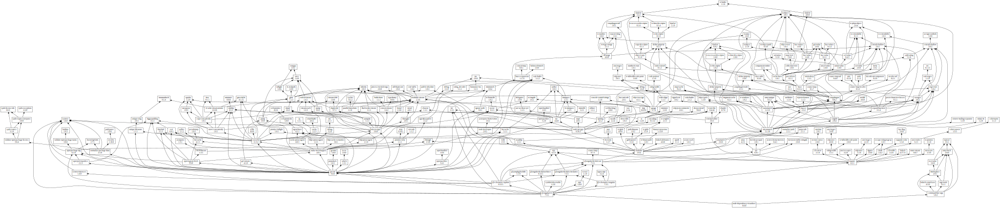
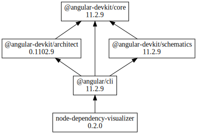
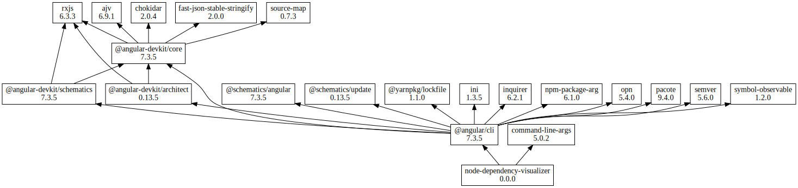

# node-dependency-visualizer

node-dependency-visualizer is a tool, that visualizes the dependencies of your node module in a digraph. Unlike madge it does not illustrate CommonJS modules (aka JavaScript file dependencies) but node module dependencies.

## Installation

To use it as a cli tool install it globally, else you can install it as dev dependency in your package.

```
npm install -g node-dependency-visualizer
```

```
npm install --save-dev node-dependency-visualizer
```

## Usage

### CLI

node-dependency-visualizer has the following options:

| Option | Description |
| :----- | :---------- |
| --treewalk-prefix (-p) PREFIX | The tree walk only continues on modules, that start with PREFIX. |
| --show-leaf-dependencies (-l) | The leaf dependencies (those on which recursion stops) are only emitted when this option is set. |

node-dependency-visualizer emits a dot digraph, which can be piped directly into graphviz dot.

```
node-dependency-visualizer | dot -Tsvg > node-module-dependency-tree.svg
```



Only show packages from @angular scope:

```
node-dependency-visualizer -p @angular | dot -Tsvg > node-module-dependency-tree.svg
```



Only show packages from @angular scope and their direct dependencies:

```
node-dependency-visualizer -p @angular -l | dot -Tsvg > node-module-dependency-tree.svg
```



For the windows users: I don't know how to do that in cmd.exe. Get a life! Ah, and please submit a pull request to this repository in case you found it out.

### API

ATM there is only one function, which is exported from this module. See the code in `js/tree.js` for its signature.


